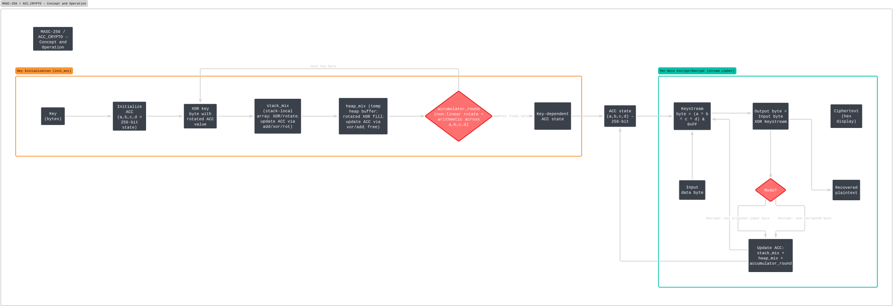
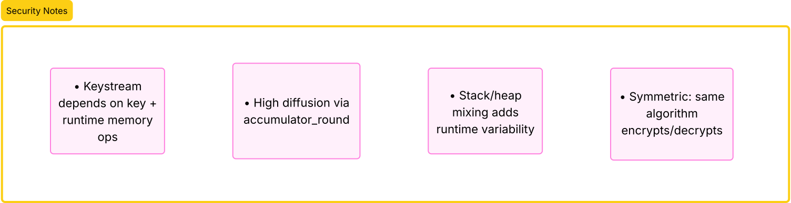

# MASC-256 (Memory Accumulator Stack Cipher 256-bit)

MASC-256 is a continuous evolution symmetric stream cipher utilizing memory-dependent entropy strategies. It achieves high diffusion by continuously updating a 256-bit internal state via rotations, XOR operations, and localized memory operations.

## Architecture Diagram



## Core Components

### Accumulator State (ACC)

The system maintains a 256-bit state split into four 64-bit values: `a`, `b`, `c`, and `d`.
This accumulator evolves continuously through the encryption and decryption processes to guarantee state diffusion.

### Key Initialization (`init_acc`)

Each key byte modifies the accumulator using XOR operations paired with rotations of the current state.
Subsequent to each byte processing, the state undergoes stack mixing, heap mixing, and a non-linear round operation.
This sequence produces a unique, key-dependent initial state.

### Stack Mixing (`stack_mix`)

Generates local stack entropy by combining the input byte with existing accumulator values.

- Updates variables `a`, `b`, `c`, `d` through XOR, addition, and bitwise rotations.
- Ensures transient memory values on the stack immediately contribute to the keystream.

### Heap Mixing (`heap_mix`)

Allocates a temporary multi-element heap buffer.

- Each heap element combines the accumulator state and a seed utilizing rotations and XOR.
- The primary accumulator is then updated via addition and XOR operations against the heap buffer elements.
- Introduces extended, memory-dependent structural entropy.

### Accumulator Round (`accumulator_round`)

Applies a structured series of non-linear rotations and combinations across all four primary state variables.

- Function: Amplifies state diffusion.
- Consequence: Ensures minor input variations propagate comprehensively across the entire state.

## Encryption and Decryption Process

For each processed byte of input/ciphertext:

1. Combine current accumulator values (`a ^ b ^ c ^ d`) and mask down to generate a single-byte keystream.
2. XOR the generated keystream with the discrete input byte.
3. Update the accumulator using stack mixing, heap mixing, and a final accumulator round. The mixed value is the plaintext byte (during encryption) or the raw ciphertext byte (during decryption).

The symmetry of the cipher dictates the same algorithmic steps apply during decryption. Byte order is preserved, and cipher state synchronizes utilizing the original ciphertext values to force identically matched accumulator updates.

## Output Handling

Binary output bytes are converted to hexadecimal representations for terminal output and storage to handle all 256 possible byte permutations natively.

## Security Properties

- **Memory-Dependent Keystream:** Side-channel attacks are mitigated through reliance on dynamic heap and stack states.
- **High Diffusion:** Continuous and aggressive accumulator phase evolution ensures structural integrity.
- **Transient Entropy Generation:** Stack and heap mixing inject non-linear entropy sourced directly from runtime memory interactions.
- **Unique State Allocation:** Key-dependent initialization dictates that each distinct key yields a completely divergent internal state.

The combined structure constructs a stream cipher resistant to static-state or simplistic XOR-based attacks while preserving complete reversible symmetric encryption paradigms.



## Compilation and Execution

Use CMake or Make to compile the binary.

Using `make` (wrapper for CMake):

```bash
make all
make run
```

Using `cmake` directly:

```bash
cmake -B build -S .
cmake --build build
./build/Debug/acc_crypto
```
